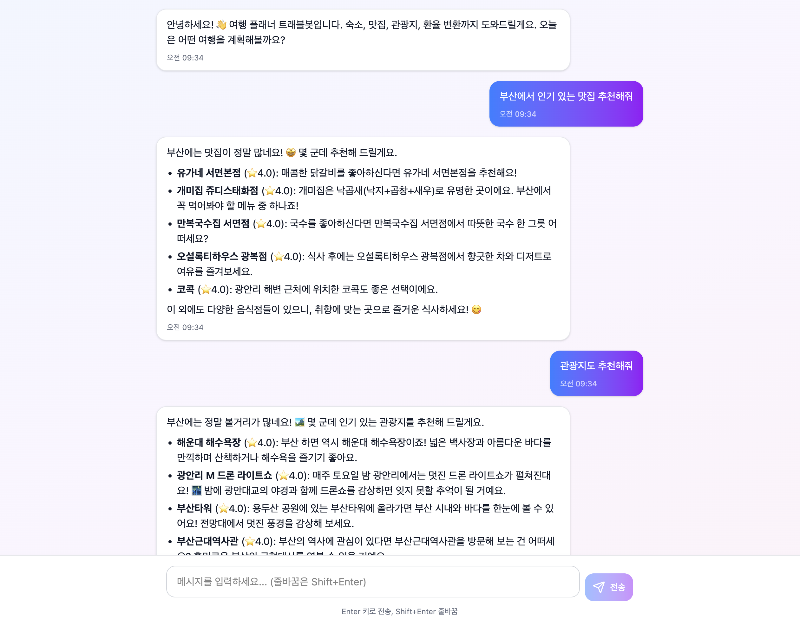

# TravelBot

여행 관광지, 숙소, 음식, 환율 등 질의에 대답해주는 AI 챗봇



## 목차

- [프로젝트 개요](#프로젝트-개요)
- [빠른 시작](#빠른-시작)
- [프로젝트 구조](#프로젝트-구조)
- [API 키 설정](#api-키-설정)
- [API 엔드포인트](#api-엔드포인트)
- [워크플로우](#워크플로우)

## 프로젝트 개요

### 주요 기능

- 🏨 **숙소 검색**: 전 세계 도시의 숙소 정보 검색 (Amadeus API)
- 🍽️ **음식점 검색**: 도시별 맛집 및 음식점 추천 (Geoapify Places API)
- 🗺️ **관광지 검색**: 인기 관광지 및 명소 검색 (Geoapify Places API)
- 💱 **환율 변환**: 실시간 환율 정보 및 통화 변환 (한국수출입은행 API)
- 💬 **멀티턴 대화**: 세션 기반 대화 히스토리 관리 및 맥락 유지
- 🌍 **다국어 도시명 지원**: 한국어, 영어, 약어(LA, NYC, SF 등) 자동 인식 및 정규화

### 기술 스택

**Backend**
- Java 17
- Spring Boot 3.5.7
- LangChain4j 0.34.0 (AI 오케스트레이션)
- Google Gemini 2.5 Flash (LLM)
- OkHttp 4.12.0 (HTTP Client)
- Jackson (JSON 처리)
- Lombok

**Frontend**
- React + TypeScript
- Vite
- Tailwind CSS
- shadcn/ui

**외부 API**
- Google Gemini API (AI 챗봇)
- Amadeus API (숙소 검색)
- Geoapify API (음식점, 관광지, 지오코딩)
- 한국수출입은행 API (환율 정보)

## 빠른 시작

### 환경 설정

1. **Java 17 설치 확인**
   ```bash
   java -version
   ```

2. **프로젝트 클론**
   ```bash
   git clone <repository-url>
   cd TravelBot
   ```

3. **API 키 설정**
   `src/main/resources/secret-application.yml` 파일을 생성하고 다음 내용을 추가하세요:
   ```yaml
   langchain:
     geminiApiKey: YOUR_GEMINI_API_KEY
   
   amadeus:
     apiKey: YOUR_AMADEUS_API_KEY
     apiSecret: YOUR_AMADEUS_API_SECRET
   
   geoapify:
     apiKey: YOUR_GEOAPIFY_API_KEY
   
   exchange-rates:
     apiKey: YOUR_KOREA_EXIM_API_KEY
   ```
   
   > ⚠️ `secret-application.yml`은 `.gitignore`에 포함되어 있어 Git에 커밋되지 않습니다.

### 서버 실행

1. **프론트엔드 빌드 (자동)**
   ```bash
   ./gradlew build
   ```
   - `Travel_Chatbot_Interface_Design` 디렉토리의 React 소스 코드가 빌드됩니다
   - 빌드된 결과물이 `src/main/resources/static` 디렉토리에 생성됩니다
   - `processResources` 태스크가 `buildFrontend`에 의존하므로 자동으로 빌드됩니다

2. **서버 실행**
   ```bash
   ./gradlew bootRun
   ```
   
   또는 IDE에서 `TravelbotApplication.java`를 실행하세요.

3. **접속**
   - 웹 브라우저에서 `http://localhost:8080` 접속
   - 챗봇 인터페이스가 자동으로 표시됩니다

### 프론트엔드 빌드 구조

**개발 디렉토리 (소스 코드)**
- `Travel_Chatbot_Interface_Design/`: React 소스 코드 디렉토리
  - `src/`: React 컴포넌트 및 소스 파일
  - `package.json`: 의존성 및 빌드 스크립트
  - `vite.config.ts`: Vite 빌드 설정 (출력 경로: `../src/main/resources/static`)

**빌드 결과물 (배포용)**
- `src/main/resources/static/`: Spring Boot가 정적 리소스로 서빙하는 디렉토리
  - `index.html`: 빌드된 HTML 파일
  - `assets/`: 번들된 JS/CSS 파일 (예: `index-BQ_eDTdf.js`, `index-BgVwnFu7.css`)

**빌드 프로세스**
1. `npm run build` 실행 (Vite)
2. `Travel_Chatbot_Interface_Design`의 소스 코드를 번들링
3. 결과물을 `src/main/resources/static`에 출력
4. Spring Boot가 `static` 디렉토리의 파일을 정적 리소스로 서빙

> ⚠️ **주의**: `src/main/resources/static`은 빌드 결과물이므로 Git에 커밋하지 않습니다. 소스 코드는 `Travel_Chatbot_Interface_Design`에 있습니다.

### 개발 모드

**프론트엔드만 별도 실행 (개발용)**
```bash
cd Travel_Chatbot_Interface_Design
npm install
npm run dev
```
- 개발 서버가 `http://localhost:3000`에서 실행됩니다
- Hot Module Replacement (HMR) 지원으로 코드 변경 시 자동 반영
- 백엔드 API는 `http://localhost:8080`에서 실행 중이어야 합니다

## 프로젝트 구조

```
TravelBot/
├── src/main/java/com/yd/travelbot/
│   ├── domain/                          # 도메인별 패키지
│   │   ├── accommodation/               # 숙소 도메인
│   │   │   ├── application/            # 유스케이스, DTO
│   │   │   ├── domain/                 # 엔티티, 리포지토리 인터페이스, 도메인 서비스
│   │   │   └── infra/                  # 외부 API 구현체
│   │   ├── chatbot/                    # 챗봇 도메인
│   │   │   ├── application/            # ProcessChatMessageUseCase
│   │   │   ├── domain/                 # TravelAssistant, TravelTools, ChatService
│   │   │   └── ui/                     # ChatController
│   │   ├── currency/                   # 환율 도메인
│   │   ├── food/                       # 음식점 도메인
│   │   └── place/                      # 관광지 도메인
│   ├── global/                         # 전역 공통 기능
│   │   ├── config/                     # 설정 클래스
│   │   ├── location/                   # 도시 좌표 해석 (GeoapifyCityResolver)
│   │   ├── exception/                  # 전역 예외 처리
│   │   └── util/                       # 유틸리티
│   └── TravelbotApplication.java       # 메인 애플리케이션
├── Travel_Chatbot_Interface_Design/    # React 프론트엔드
│   └── src/
│       ├── App.tsx                     # 메인 컴포넌트
│       └── components/                 # UI 컴포넌트
├── src/main/resources/
│   ├── application.yml                 # 기본 설정
│   └── secret-application.yml          # API 키 (gitignore)
└── build.gradle                        # Gradle 빌드 설정
```

### 아키텍처 패턴

- **Domain-Driven Design (DDD)**: 도메인별로 패키지 분리
- **Layered Architecture**: 
  - `ui`: 컨트롤러 레이어
  - `application`: 유스케이스 레이어
  - `domain`: 도메인 로직 레이어
  - `infra`: 인프라스트럭처 레이어 (외부 API 구현)

## API 키 설정

### 1. Google Gemini API

1. [Google AI Studio](https://makersuite.google.com/app/apikey) 접속
2. API 키 생성
3. `secret-application.yml`에 추가:
   ```yaml
   langchain:
     geminiApiKey: YOUR_API_KEY
   ```

### 2. Amadeus API (숙소 검색)

1. [Amadeus for Developers](https://developers.amadeus.com/) 가입
2. API 키 및 Secret 생성
3. `secret-application.yml`에 추가:
   ```yaml
   amadeus:
     apiKey: YOUR_API_KEY
     apiSecret: YOUR_API_SECRET
   ```

### 3. Geoapify API (음식점, 관광지, 지오코딩)

1. [Geoapify](https://www.geoapify.com/) 가입
2. API 키 생성 (무료 플랜 제공)
3. `secret-application.yml`에 추가:
   ```yaml
   geoapify:
     apiKey: YOUR_API_KEY
   ```

### 4. 한국수출입은행 API (환율)

1. [한국수출입은행 Open API](https://www.koreaexim.go.kr/ir/HPHKIR020M01?apino=2&viewtype=C#tab1) 접속
2. API 키 신청 및 발급
3. `secret-application.yml`에 추가:
   ```yaml
   exchange-rates:
     apiKey: YOUR_API_KEY
   ```

## API 엔드포인트

### POST /api/chat

챗봇과 대화를 주고받는 엔드포인트입니다.

**Request**
```json
{
  "message": "서울 맛집 추천해줘",
  "sessionId": "optional-session-id"
}
```

**Response**
```json
{
  "success": true,
  "message": "서울의 맛집을 찾아봤어요! ...",
  "sessionId": "uuid-generated-session-id"
}
```

**세션 관리**
- 첫 요청 시 `sessionId`를 생략하면 서버가 자동으로 생성
- 이후 요청에는 응답으로 받은 `sessionId`를 포함하여 멀티턴 대화 유지
- 세션별로 최대 10개의 메시지 히스토리 유지

## 워크플로우

### 1. 사용자 메시지 처리 흐름

```
사용자 입력
    ↓
ChatController (/api/chat)
    ↓
ProcessChatMessageUseCase
    ↓
ChatService.chatWithHistory()
    ↓
TravelAssistant (LangChain4j AiServices)
    ↓
TravelTools (@Tool 메서드 자동 호출)
    ↓
도메인별 UseCase 실행
    ↓
외부 API 호출 (Amadeus, Geoapify, 한국수출입은행)
    ↓
LLM이 결과를 자연스러운 대화 형식으로 변환
    ↓
사용자에게 응답
```

### 2. LangChain4j 기반 AI 파이프라인

**TravelAssistant 인터페이스**
- `@SystemMessage`: 챗봇의 역할과 행동 지침 정의
- `@UserMessage`: 사용자 입력을 받는 메서드
- LangChain4j가 자동으로 프록시 구현체 생성

**TravelTools 클래스**
- `@Tool` 어노테이션으로 도구 메서드 정의
- LLM이 필요에 따라 자동으로 도구 호출
- 멀티홉 추론 지원 (예: "제주도 관광지와 맛집 추천" → searchPlace + searchFood 자동 호출)

**ChatMemory**
- `MessageWindowChatMemory.withMaxMessages(10)`: 세션별 최대 10개 메시지 유지
- 세션 ID 기반으로 대화 히스토리 관리
- 멀티턴 대화 맥락 유지

### 3. 도시명 정규화 및 지오코딩

```
사용자 입력: "LA 맛집"
    ↓
전처리: "LA" (구두점 제거, 공백 정리)
    ↓
AI 정규화: "Los Angeles" (LangChain4j Gemini)
    ↓
Geoapify 지오코딩: 좌표 획득
    ↓
Geoapify Places API: 음식점 검색
```

**지원 기능**
- 다국어 도시명: "서울", "Seoul", "Tokyo", "파리" 등
- 약어/별칭: "LA", "NYC", "SF", "NOLA", "CDMX" 등
- 구두점 처리: "S.F." → "SF" → "San Francisco"

### 4. 환율 변환 처리

```
사용자 입력: "100달러를 원화로"
    ↓
의도 분석: CURRENCY
    ↓
통화 추출: USD → KRW
    ↓
한국수출입은행 API 호출
    ↓
주말/공휴일 처리: 최대 5일 전까지 자동 재시도
    ↓
환율 계산 및 변환
    ↓
유의사항 포함 응답 생성
```

**특징**
- 주말/공휴일 자동 처리: 빈 배열 응답 시 이전 영업일로 재시도
- 통화 단위 처리: JPY(100), IDR(100) 등 단위 보정
- 간접 변환: USD → KRW → CNY 등 비KRW 통화 쌍 지원

### 5. 에러 처리 및 재시도

**LLM API 과부하 (503 에러)**
- 최대 3회 재시도 (exponential backoff)
- 재시도 간격: 1초, 2초, 4초
- 모든 재시도 실패 시 우아한 폴백 메시지 반환

**환율 API 빈 응답**
- 주말/공휴일 감지 시 최대 5일 전까지 자동 재시도
- 모든 재시도 실패 시 기본 환율 사용

## 라이선스

이 프로젝트는 단기 프로젝트로 개발되었습니다.
